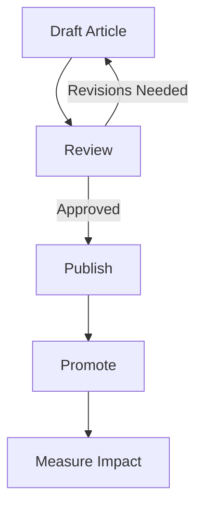

Technical writing isn’t just about words, it’s about helping readers see how concepts fit together. One lightweight, docs-as-code-friendly way to do this is [Mermaid](https://mermaid.js.org/).

Mermaid lets you define diagrams in plain text, then render them in your documentation site. When paired with ChatGPT, you can quickly generate useful diagrams without wrestling with a UI.

---

## Why Use Mermaid?
There are a few reasons to integrate Mermaid into your documentation:
- Docs-as-Code Friendly – Define diagrams alongside your Markdown docs.
- Version Controllable – Diagrams live as text, not binary assets.
- Lightweight & Flexible – No heavy diagramming tool required.

---

## Example: Flow Chart

Let’s imagine documenting the content publishing workflow. ChatGPT can help you generate the Mermaid code for a related flow chart:

```bash title="Mermaid"
flowchart TD
    A[Draft Article] --> B[Review]
    B -->|Approved| C[Publish]
    B -->|Revisions Needed| A
    C --> D[Promote]
    D --> E[Measure Impact]
```

This shows the loop between drafting and review, and the linear path to publishing and measurement.

## Tips for Using ChatGPT + Mermaid

Here are some ways you can get the most of out of using ChatGPT to generate instructions for Mermaid:
- Be specific in your prompt: e.g., “Create a Mermaid flow chart for a publishing workflow.”
- If nodes overlap or the layout is messy, ask ChatGPT to adjust spacing or direction (e.g., TD, LR, BT).
- Use Mermaid’s diagram types beyond flow charts and mind maps—like sequence diagrams, state machines, or Gantt charts.

---

## Integrate Mermaid into your Docs

Now that you have the code to generate the flow chart in Mermaid, you can integrate it into your docs.

First though, you'll need to install mermaid in your development environment. Check out the [Mermaid User Guide](https://mermaid.js.org/intro/getting-started.html) instructions on how to do so.

Once Mermaid is installed and ready to go, you can add the Mermaid instructions as a code block to your Markdown file.

If you've set up everything correctly, it will show up as below:


Alternatively, you can store the diagram code in a separate `.mmd` files, then reference those `.mmd` files in your Markdown.

Or, you can pre-render your Mermaid diagrams as SVG image files as part of your build process, and include those images in your Markdown.

These methods allow you to keep your code cleaner and maintain a clear source of truth, while also including your visuals as images.

---

## Wrapping Up

By combining ChatGPT’s text generation with Mermaid’s diagramming syntax, you can:
- Quickly move from idea to visualization
- Keep diagrams source-controlled
- Improve clarity in your documentation

It’s a small but powerful way to bring diagrams into your docs-as-code workflow without adding new heavyweight tools.