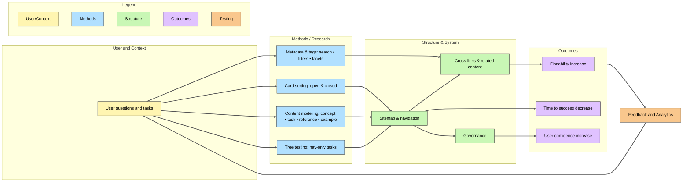

When most people hear information architecture (IA), they picture a table of contents or a sitemap: just a way to “organize docs.” But IA is more than a tidy folder structure — it’s a user experience (UX) practice that directly shapes how people navigate, understand, and succeed with your product.

## Why IA Belongs in UX

Every interaction your reader has with your docs is part of their product journey. A good IA reduces friction: it makes the right content appear in the right place at the right time. A weak IA does the opposite — forces users to hunt, backtrack, or give up.

Seen this way, IA isn’t about the writer’s preference for order. It’s about enabling users to move smoothly from question to answer, from confusion to confidence.

## Methods for Building IA You Can Repeat

Like any UX practice, IA works best when you apply repeatable methods rather than gut instinct. A few proven approaches:

### 1. Card Sorting

Put your content (or potential content topics) on cards and ask users to group them in ways that make sense to them.

- **Open sort**: users create their own categories.
- **Closed sort**: you provide categories and users place items into them.

Insights from card sorting often challenge assumptions about how teams name or group content.

### 2. Content Modeling

Step back and define the building blocks of your docs. For example: concept → task → reference → example.

- Map how each piece connects.
- Ensure consistency across the system.

Content modeling helps writers avoid duplication and makes it easier to scale when the product grows.

### 3. Tree Testing

Once you have a draft structure, validate it. Present users with navigation-only tasks (“Where would you click to learn how to set up integrations?”) and track their paths. This shows whether your structure supports real-world use.

### 4. Metadata and Tags

Don’t stop at hierarchy. Tags, filters, and metadata make docs more discoverable. Think of it as IA beneath the surface — structuring your content for search engines, internal search, and cross-linking.

## A UX Mindset for Docs

Treating IA as UX changes how you approach your docs:

- You focus less on “what looks neat” and more on “what removes friction.”
- You test with users instead of guessing.
- You build systems that scale instead of patching navigation issue by issue.

In short: IA is not just a docs housekeeping exercise. It’s a UX discipline — one that connects users to the knowledge they need, when they need it most.