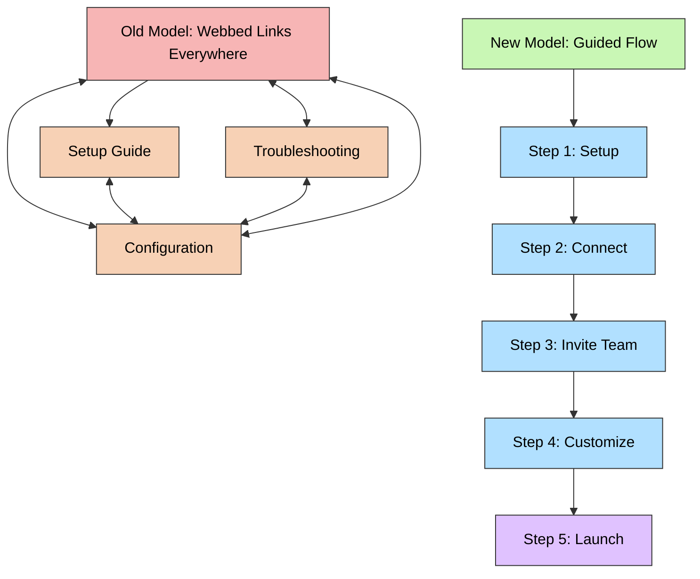

When I first started working on user onboarding content, I inherited what many technical writers eventually encounter: a **help center maze**.

Every topic linked to everything else. Setup articles linked to configuration guides that linked to troubleshooting docs that linked back to setup again.

The intention was good — make sure users have every option at their fingertips — but in practice, it produced chaos.

New users didn’t know where to start or what to do next. They clicked, skimmed, clicked again, and left. The were overwhelmed almost immediately.

So I redesigned the onboarding journey — not just by rewriting, but by **restructuring.** Instead of scattering information across dozens of disconnected articles, I created a *guided path*: docs for each specific type of user structured in a sequential order. Each doc focused on a single stage of setup; each one leading naturally to the next.

It worked. Users began moving through the flow without confusion. Support requests dropped, as did negative reactions to the onboarding docs.

And I realized something important:
    
    **Good onboarding content isn’t just clear — it’s choreographed.**

That insight is where documentation overlaps with **content strategy** and **UX theory**.

Below, I’ll share how three classic design principles — the F-shaped reading pattern, the Law of Proximity, and Miller’s Law — shaped this approach.

---

# The F-Shaped Reading Pattern: Designing for Attention

Eye-tracking studies by the Nielsen Norman Group show that users scan web pages in an **F-shaped pattern**. They read the first few lines fully, then skim down the left margin, making shorter horizontal glances as they go.

For onboarding docs, that means:
- Users focus most intensely on the **opening lines** and **left-aligned structure** (headings, callouts, numbered steps).
- Critical context and next-step links should appear where the eye naturally lands — not buried below a screenshot or paragraph block.

When I redesigned our onboarding content, I made sure each article followed this visual rhythm:
- A **one-line orientation** at the top (“In this step, you’ll connect your account.”)
- Numbered steps aligned along the **left margin** — no bullets buried mid-screen.
- A **clearly visible callout** stating the audience of the doc, and containing one or two (at most) **highly relevant links** within the first F-pattern sweep.

By meeting readers where their eyes already go, we built momentum through attention rather than demanding it.

Each doc included a link to the next in the linear onboarding flow in a “Next Steps” section at the bottom. In retrospect, I would include that link within the callout in the introductory section, to be better captured by F-pattern reading. Live and learn!

---

# Miller’s Law: Designing for Memory

Psychologist George Miller’s classic research suggests that people can hold about **7 ± 2 items** in working memory at once.

This idea — known as **Miller’s Law** — is why phone numbers, lists, and even stories often come in sets of 5–9 elements.

Applied to documentation, it becomes a principle of *chunking*:
- Limit each article to roughly **five to seven major steps or ideas**.
- Treat each doc as one “memory unit” in a larger learning path.
- Avoid overloading users with branching conditions (“If this, do that… unless you did this other thing.”).

There were a few ways I applied Miller’s Law to the onboarding flow:
1. Keep all bullet lists within the 5-7 point range whenever possible.
2. Ensure users get the most important information within the first 5 article topics.
3. Chunk content into shorter articles with a self-contained focus, so users could digest one and leave, then come back later to continue without feeling lost.

That structure wasn’t arbitrary — it matched Miller’s Law. Each doc was short enough to complete in 3-5 minutes, and the sequence was long enough to feel like progress. Users would learn something valuable each time they stepped into the flow, even if just for a few short time.

As a result users finished the self-serve onboarding process faster, and they **remembered** how the system fit together.

---

# The Law of Proximity: Designing for Association
The **Law of Proximity**, one of the *Gestalt principles of perception*, states that elements placed near each other are perceived as related.

In practice, this applies at two levels in documentation:
1. **Macro-level (information architecture)**:
Group onboarding materials into a **dedicated container or section** rather than scattering them throughout the help center. When users see articles physically close together, they infer a logical relationship — “these belong to the same journey.”

2. **Micro-level (page design)**:
 Within each doc, keep related steps, visuals, and outcomes grouped tightly. For example:
- Place screenshots immediately after the step they illustrate.
- Cluster “Next Steps” and “Troubleshooting” links in clearly labeled blocks.
- Provide solutions together with descriptions of errors and obstacles.
- Use consistent headings and spacing to visually reinforce containment.
- Avoid linking users to other documentation that is only peripherally related.

This relatively small amount of visual discipline had an outsized effect. Users stopped wandering off to unrelated articles because the design itself suggested continuity.

---

# From Maze to Map: Before and After

Here’s a visualization of how onboarding content structure becomes simpler when structured in a logical sequential flow:

The difference is less about hierarchy and more about **direction**. The webbed model assumes the user knows where to go; the sequential model *shows* them.

---